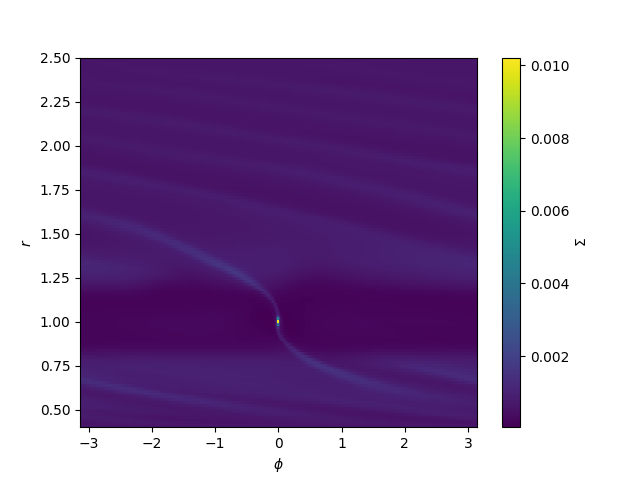

# Explore your FARGO3D simulation outputs with `Fargonaut`!

Fargonaut is a package for post-processing and visualising outputs of [FARGO3D](https://github.com/FARGO3D/fargo3d), written in Python.

```py
>>> from fargonaut.output import Output

>>> output = Output("/path/to/fargo3d/outputs/fargo")
>>> gasdens50 = output.get_field("gasdens", 50)
>>> gasdens50.plot()
```



## Contributing to Fargonaut

Contributions to Fargonaut are welcome. Please see the [contributing guidelines](CONTRIBUTING.md).

## License

Fargonaut is fully open source. For more information about its license, see [LICENSE](LICENSE.md).
